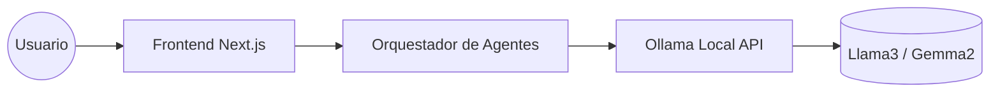
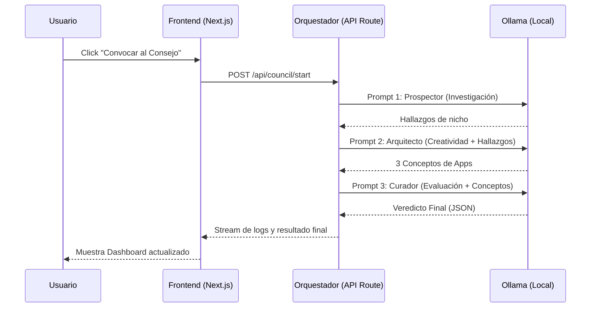
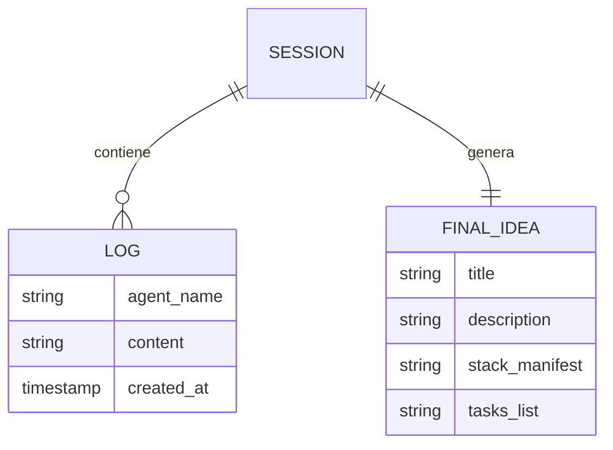
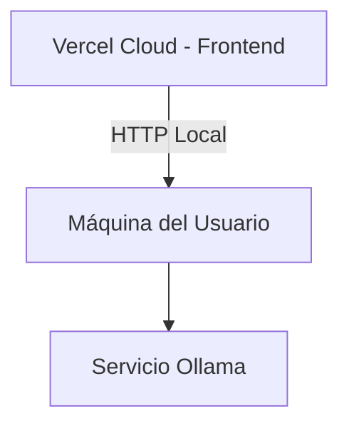

# Software Design Document (SDD) - The High Council

## 1. Introduction

**Purpose:** Definir el diseño técnico y la arquitectura del sistema "The High Council", una plataforma de orquestación de agentes de IA locales para la generación de ideas de proyectos.

**Scope:** El sistema abarca desde la interfaz de usuario (Frontend) hasta la lógica de orquestación de prompts y la integración con modelos locales vía Ollama. Queda fuera de alcance cualquier integración con APIs de nube pagas (OpenAI/Anthropic) en el MVP.

### Definitions and Acronyms

- **Ollama:** Herramienta para ejecutar LLMs localmente.
- **Vibe Coding:** Metodología de desarrollo guiada por IA con mínima intervención manual en la lógica de bajo nivel.
- **LLM:** Large Language Model.

### References

- Product Requirements Document (PRD)
- Guía JAVASCRIPT PETER

## 2. System Overview

**System Description:** Una aplicación web local que actúa como una "sala de juntas" virtual donde tres agentes de IA (Prospector, Arquitecto, Curador) debaten secuencialmente para entregar una propuesta de proyecto de software.

**Design Goals:** Baja latencia, ejecución 100% local, interfaz altamente visual y reactiva.

**Architecture Summary:** Arquitectura de cliente-servidor desacoplada. Un frontend en React (Next.js) se comunica con un orquestador que gestiona llamadas secuenciales a la API de Ollama.

### System Context Diagram

## 3. Architectural Design

### System Architecture Diagram

### Component Breakdown

- **UI Dashboard:** Panel principal con tres "Agent Cards" que muestran el stream de texto en tiempo real.
- **Agent Orchestrator:** Lógica de servidor que mantiene el estado de la conversación y encadena los outputs como inputs para el siguiente agente.
- **Ollama Connector:** Capa de abstracción para manejar la comunicación HTTP con `localhost:11434`.

### Technology Stack

- **Frontend:** Next.js 14 (App Router), Tailwind CSS, Lucide React (iconos).
- **Backend:** Next.js API Routes (Node.js) para simplicidad de despliegue.
- **Modelos:** Ollama (Llama3 para lógica, Gemma2 para creatividad).

## 4. Detailed Design

### AgentOrchestrator

**Responsibilities:** Gestionar la secuencia de prompts y asegurar que el contexto se transfiera correctamente entre agentes.

**Interfaces/APIs:**
- **Inputs:** Tema opcional del usuario (string).
- **Outputs:** Stream de eventos (Server-Sent Events) con los logs de cada agente y el objeto final de la idea.

**Error Handling:** Si Ollama no responde, el orquestador devuelve un error amigable sugiriendo verificar si el servicio de Ollama está corriendo.

**State Management:** React `useState` y `useEffect` para manejar el flujo visual en el cliente.

## 5. Database Design

### ER Diagram

**Tables/Collections:** Para el MVP se usará LocalStorage para persistir la última idea generada. Si se requiere historial, se implementará SQLite localmente.

## 6. External Interfaces

### User Interface

- Estilo "Dark Mode" inspirado en interfaces de monitoreo.
- Botón central con efecto de resplandor (glow).
- Tres columnas verticales: `[Prospector | Arquitecto | Curador]`.

### External APIs

- **Ollama API:** `POST /api/generate` o `POST /api/chat`.

## 7. Security Considerations

- **Authentication:** No requerida (Acceso local).
- **Data Protection:** Todos los datos permanecen en la máquina del usuario.
- **Threat Model:** El riesgo principal es la inyección de prompts, mitigado por el uso de system prompts fijos.

## 8. Performance and Scalability

- **Expected Load:** 1 usuario concurrente (uso personal).
- **Caching Strategy:** No necesaria para el MVP.
- **Scaling Strategy:** El rendimiento depende directamente de la GPU/CPU local donde corra Ollama.

## 9. Deployment Architecture

- **Environments:** Desarrollo Local únicamente.
- **CI/CD Pipeline:** GitHub Actions para linting y verificación de tipos; Vercel para hosting del frontend (conectando al Ollama local del usuario mediante túneles o configurando CORS).

### Infrastructure Diagram

## 10. Testing Strategy

- **Unit Testing:** Pruebas de los parsers de prompts para asegurar que el Curador siempre devuelva el formato esperado.
- **Quality Metrics:** 100% de éxito en la cadena de 3 agentes antes de mostrar el resultado al usuario.

## 11. Appendices

### Glossary

- **System Prompt:** Instrucciones base que definen la personalidad de la IA.
- **Prompt Chaining:** Técnica de usar la salida de una IA como entrada de otra.

### Change History

- **v1.0 (2026-02-28):** Versión inicial del diseño para el Consejo de IAs.
