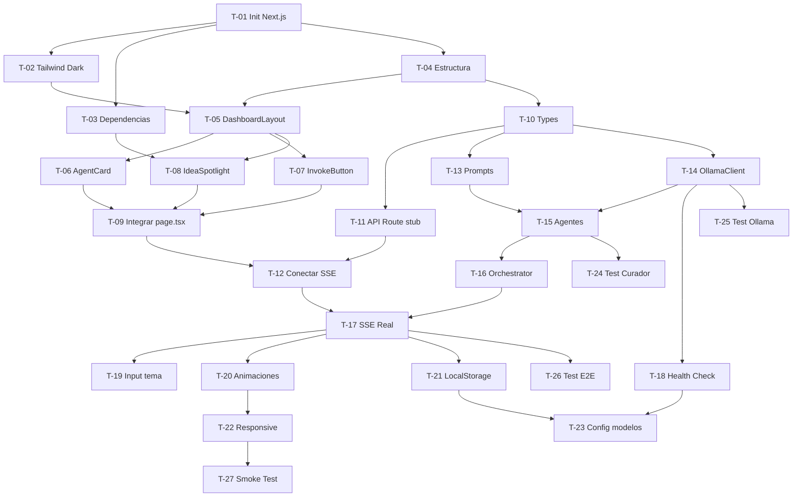

# 📋 The High Council — MVP Todo

> Generado a partir de **PRD.md**, **SDD.md** y **STACK.md**.
> Cada tarea está diseñada para completarse en **≤ 2 horas**.
>
> **Leyenda:**
>
> - `🧪 mock` → usa datos hardcodeados / stubs
> - `🔌 real` → integración real (Ollama, SSE, etc.)
> - `depende de: T-XX` → no iniciar hasta completar esa tarea

---

## Fase 1 · Setup del Proyecto

### T-01 — Inicializar repo Next.js 14+ con App Router y TypeScript

- [x] `npx create-next-app@latest ./ --typescript --tailwind --app --eslint`
- **Depende de:** nada
- **Tipo:** 🔌 real
- ✅ **Aceptación:**
  - `npm run dev` arranca sin errores en `localhost:3000`
  - El proyecto usa App Router (`app/` dir) y TypeScript strict
- **Observación:**
  - El directorio raíz actual ya no está vacío, lo cual podría generar un problema con create-next-app. Se recomienda crear una carpeta para el proyecto y ejecutar el comando dentro de ella.

### T-02 — Configurar Tailwind CSS con tema dark-mode

- [ ] Configurar `tailwind.config.ts` con `darkMode: 'class'`, paleta oscura personalizada (fondo `#0a0a0f`, acentos neón), fuente `Inter` / `JetBrains Mono`
- **Depende de:** T-01
- **Tipo:** 🔌 real
- ✅ **Aceptación:**
  - La página root renderiza con fondo oscuro y tipografía configurada
  - Las clases `dark:` aplican correctamente

### T-03 — Instalar dependencias core

- [ ] Instalar: `lucide-react`, `react-markdown`, `remark-gfm` (para renderizar Markdown del Curador)
- [ ] Opcional: `langchain` / `@langchain/community` si se decide usar para orquestación
- **Depende de:** T-01
- **Tipo:** 🔌 real
- ✅ **Aceptación:**
  - `npm install` sin conflictos de peer dependencies
  - Imports funcionan en un componente de prueba

### T-04 — Crear estructura de carpetas del proyecto

- [x] Crear estructura de directorios:
  ```
  app/
    layout.tsx
    page.tsx
    api/
      council/
        start/route.ts
  components/
    AgentCard.tsx
    InvokeButton.tsx
    IdeaSpotlight.tsx
    DashboardLayout.tsx
  lib/
    agents/
      prospector.ts
      architect.ts
      curator.ts
    ollama/
      client.ts
    orchestrator.ts
    prompts/
      prospector-prompt.ts
      architect-prompt.ts
      curator-prompt.ts
    types.ts
  ```
- **Depende de:** T-01
- **Tipo:** 🔌 real
- ✅ **Aceptación:**
  - Todas las carpetas y archivos placeholder existen
  - No hay errores de import en `layout.tsx`

---

## Fase 2 · Frontend Base

### T-05 — Construir `DashboardLayout` (shell principal)

- [ ] Layout de 3 columnas responsivo con header "The High Council" y footer mínimo
- [ ] Dark mode por defecto, estilo "monitoring dashboard" (SDD §6)
- **Depende de:** T-02, T-04
- **Tipo:** 🧪 mock (contenido placeholder)
- ✅ **Aceptación:**
  - La página muestra 3 columnas en desktop y se apila en mobile
  - El header muestra el nombre de la app con ícono

### T-06 — Construir componente `AgentCard`

- [ ] Card con: avatar/ícono del agente, nombre, rol, área de texto con scroll para el stream
- [ ] Estados visuales: `idle`, `thinking` (animación pulse), `done` (borde verde)
- [ ] Props: `agentName`, `role`, `status`, `content`
- **Depende de:** T-05
- **Tipo:** 🧪 mock (texto hardcodeado)
- ✅ **Aceptación:**
  - 3 AgentCards renderizan con datos mock
  - La animación `thinking` es visible y fluida

### T-07 — Construir componente `InvokeButton`

- [ ] Botón central "Convocar al Consejo" con efecto glow (REQ-05)
- [ ] Estados: `ready`, `loading` (spinner + disable), `done`
- [ ] Debe ser prominente y centrado sobre las columnas
- **Depende de:** T-05
- **Tipo:** 🧪 mock (onClick simula un setTimeout)
- ✅ **Aceptación:**
  - Click cambia estado a `loading` con animación
  - Después de 3s vuelve a `ready` (mock)

### T-08 — Construir componente `IdeaSpotlight`

- [ ] Componente de "Resultado Final" que renderiza Markdown (REQ-07)
- [ ] Usa `react-markdown` + `remark-gfm` para formato rico
- [ ] Botón "Copiar al portapapeles" para la idea completa
- **Depende de:** T-03, T-05
- **Tipo:** 🧪 mock (markdown estático)
- ✅ **Aceptación:**
  - Renderiza headings, listas, code blocks desde un string Markdown mock
  - El botón copia el texto al clipboard y muestra confirmación

### T-09 — Integrar componentes en `page.tsx` con estado local

- [ ] Orquestar `DashboardLayout` → `AgentCard` x3 + `InvokeButton` + `IdeaSpotlight`
- [ ] Manejar estado global de la sesión con `useState`: `idle | running | done`
- [ ] Click del botón → simular flujo secuencial con mock delays
- **Depende de:** T-06, T-07, T-08
- **Tipo:** 🧪 mock (flujo completo con datos falsos)
- ✅ **Aceptación:**
  - Click en "Convocar" → Prospector se ilumina → después Arquitecto → después Curador
  - Al final, `IdeaSpotlight` muestra la idea mock
  - US.1 cumplido visualmente (un solo botón → propuesta)

---

## Fase 3 · Backend Base

### T-10 — Definir tipos TypeScript compartidos (`lib/types.ts`)

- [ ] Interfaces: `AgentRole`, `AgentResponse`, `CouncilSession`, `OllamaRequest`, `OllamaStreamChunk`, `FinalIdea`
- **Depende de:** T-04
- **Tipo:** 🔌 real
- ✅ **Aceptación:**
  - Todos los componentes y API Routes importan tipos desde `lib/types.ts`
  - No hay `any` en las interfaces principales

### T-11 — Crear API Route `POST /api/council/start` (stub)

- [ ] Endpoint que recibe `{ topic?: string }` y devuelve un stream SSE mock
- [ ] Emite eventos: `agent:start`, `agent:chunk`, `agent:done`, `council:complete`
- [ ] Formato SSE: `data: { "event": "...", "agent": "...", "content": "..." }\n\n`
- **Depende de:** T-10
- **Tipo:** 🧪 mock (texto hardcodeado, delays con setTimeout)
- ✅ **Aceptación:**
  - `curl -N POST localhost:3000/api/council/start` devuelve un stream de eventos SSE
  - Los eventos llegan secuencialmente con delays simulados

### T-12 — Conectar frontend a la API Route SSE

- [ ] Hook `useCouncilStream()` que consume el endpoint SSE
- [ ] Parsea eventos y actualiza el estado de cada `AgentCard` en tiempo real
- [x] Manejar `fetch` con `ReadableStream`
- **Depende de:** T-09, T-11
- **Tipo:** 🧪 mock (API devuelve datos fake pero el streaming es real)
- ✅ **Aceptación:**
  - El texto aparece token-por-token en las AgentCards (efecto typewriter)
  - US.2 cumplido: los logs de cada agente son visibles en tiempo real

---

## Fase 4 · Orquestación de Agentes

### T-13 — Escribir system prompts para los 3 agentes

- [ ] `prospector-prompt.ts` → Prompt de investigador analítico (REQ-01)
- [ ] `architect-prompt.ts` → Prompt de arquitecto creativo (REQ-02)
- [ ] `curator-prompt.ts` → Prompt de curador evaluador, output en JSON/Markdown estructurado (REQ-03)
- **Depende de:** T-10
- **Tipo:** 🔌 real
- ✅ **Aceptación:**
  - Cada prompt tiene: `system`, `user template` con placeholders
  - El prompt del Curador exige un formato de salida con: título, descripción, stack, tareas

### T-14 — Implementar `OllamaClient` (`lib/ollama/client.ts`)

- [ ] Clase/función que wrappea `POST http://localhost:11434/api/generate`
- [ ] Soportar streaming (`.stream = true`) y non-streaming
- [ ] Timeout configurable, error handling si Ollama no está corriendo (SDD §4)
- **Depende de:** T-10
- **Tipo:** 🔌 real
- ✅ **Aceptación:**
  - Con Ollama corriendo: `ollamaClient.generate("llama3", "Hola")` devuelve texto
  - Con Ollama caído: devuelve error amigable "Ollama no está disponible"

### T-15 — Implementar lógica de agentes individuales

- [ ] `prospector.ts` → Usa `OllamaClient` + prompt del prospector, modelo `llama3`
- [ ] `architect.ts` → Recibe output del prospector como contexto, modelo `gemma2`
- [ ] `curator.ts` → Recibe outputs anteriores, modelo `mistral` o `llama3`, devuelve veredicto
- **Depende de:** T-13, T-14
- **Tipo:** 🔌 real
- ✅ **Aceptación:**
  - Cada agente recibe el contexto anterior y genera una respuesta coherente
  - El Curador devuelve un objeto parseable (JSON o Markdown estructurado)

### T-16 — Implementar `Orchestrator` (`lib/orchestrator.ts`)

- [ ] Función `runCouncil(topic?: string)` que ejecuta los 3 agentes en secuencia (REQ-04)
- [ ] Pasa output del agente N como input del agente N+1
- [ ] Emite eventos SSE al frontend durante cada paso
- [ ] Maneja errores parciales (si un agente falla, reporta pero sigue si es posible)
- **Depende de:** T-15
- **Tipo:** 🔌 real
- ✅ **Aceptación:**
  - `runCouncil()` ejecuta Prospector → Arquitecto → Curador en orden
  - El contexto se transfiere correctamente entre agentes
  - Todo el flujo completa en < 45s con modelos ligeros (PRD §8)

---

## Fase 5 · Integración Ollama (End-to-End)

### T-17 — Reemplazar mock SSE con orquestador real en API Route

- [ ] Conectar `POST /api/council/start` al `Orchestrator` real
- [ ] Stream real de tokens desde Ollama → SSE → Frontend
- **Depende de:** T-16, T-12
- **Tipo:** 🔌 real
- ✅ **Aceptación:**
  - Click en "Convocar" → Ollama genera texto real visible en las AgentCards
  - El flujo completo funciona end-to-end sin errores

### T-18 — Implementar detección de estado de Ollama

- [ ] Endpoint `GET /api/health` que verifica si Ollama está corriendo (`GET localhost:11434`)
- [ ] En el frontend: banner de advertencia si Ollama no está disponible
- [ ] Verificar qué modelos están instalados (`GET /api/tags`)
- **Depende de:** T-14
- **Tipo:** 🔌 real
- ✅ **Aceptación:**
  - Si Ollama está caído: banner rojo "Ollama no detectado" con instrucciones
  - Si falta un modelo: mensaje indicando qué modelos descargar (`ollama pull llama3`)

### T-19 — Input opcional de tema/contexto del usuario

- [ ] Campo de texto en el dashboard para que el usuario ingrese un tema (SDD §4: "Tema opcional")
- [ ] El tema se pasa como parámetro al orquestador
- [ ] Si está vacío, el Prospector elige libremente
- **Depende de:** T-17
- **Tipo:** 🔌 real
- ✅ **Aceptación:**
  - Con tema: los agentes centran su análisis en el tema dado
  - Sin tema: el flujo funciona igual con exploración libre

---

## Fase 6 · UX / Polish

### T-20 — Animaciones de transición entre agentes

- [ ] Efecto visual cuando el "turno" pasa de un agente al siguiente
- [ ] Glow border en el agente activo, fade en los completados
- [ ] Transición suave del `IdeaSpotlight` al aparecer
- **Depende de:** T-17
- **Tipo:** 🔌 real
- ✅ **Aceptación:**
  - Las transiciones son fluidas (no hay saltos bruscos)
  - El usuario puede seguir visualmente qué agente está activo

### T-21 — Persistencia en LocalStorage

- [ ] Guardar la última sesión/idea en `localStorage` (SDD §5)
- [ ] Al recargar, mostrar el último resultado si existe
- [ ] Botón "Nueva sesión" para limpiar y empezar de cero
- **Depende de:** T-17
- **Tipo:** 🔌 real
- ✅ **Aceptación:**
  - Refresh de la página muestra el último resultado generado
  - "Nueva sesión" limpia el estado y muestra el dashboard vacío

### T-22 — Responsive design y estados de error

- [ ] Verificar layout en mobile (stack vertical de AgentCards)
- [ ] Estados de error visibles: Ollama caído, timeout, modelo no encontrado
- [ ] Loading skeleton mientras se inicializa
- **Depende de:** T-20
- **Tipo:** 🔌 real
- ✅ **Aceptación:**
  - En viewport < 768px las columnas se apilan correctamente
  - Los errores muestran mensajes claros con acciones sugeridas

### T-23 — Configuración de modelos por agente (opcional)

- [ ] Modal/drawer de settings donde el usuario elige qué modelo usa cada agente (US.4)
- [ ] Dropdown con modelos disponibles (obtenidos de Ollama `/api/tags`)
- [ ] Guardar preferencias en LocalStorage
- **Depende de:** T-18, T-21
- **Tipo:** 🔌 real
- ✅ **Aceptación:**
  - El usuario puede cambiar el modelo del Prospector de `llama3` a otro
  - La configuración persiste entre sesiones

---

## Fase 7 · Testing y Validación

### T-24 — Test unitario: parseo de respuesta del Curador

- [ ] Verificar que el output del Curador se parsea correctamente a `FinalIdea`
- [ ] Casos: JSON válido, Markdown estructurado, respuesta malformada
- **Depende de:** T-15
- **Tipo:** 🧪 mock (inputs predefinidos)
- ✅ **Aceptación:**
  - 3+ test cases pasan con `npm test`
  - El parser maneja gracefully respuestas inesperadas (SDD §10)

### T-25 — Test unitario: OllamaClient

- [ ] Mock de fetch para simular respuestas de Ollama
- [ ] Tests: respuesta exitosa, Ollama caído, timeout, stream interrumpido
- **Depende de:** T-14
- **Tipo:** 🧪 mock
- ✅ **Aceptación:**
  - 4+ test cases pasan
  - Error handling devuelve mensajes amigables

### T-26 — Test de integración: flujo completo del Council

- [ ] Test end-to-end: API Route → Orchestrator → 3 agentes → respuesta final
- [ ] Puede ejecutarse con Ollama real o con mocks
- **Depende de:** T-17
- **Tipo:** 🔌 real (con Ollama) / 🧪 mock (CI)
- ✅ **Aceptación:**
  - El test completa sin errores
  - La respuesta final contiene: título, descripción, stack, tareas (PRD §8)
  - Target inicial: <45s con modelos ligeros en hardware local razonable
  - No bloqueante en primeras iteraciones

### T-27 — Smoke test visual del dashboard

- [ ] Verificar manualmente el flujo completo en el navegador
- [ ] Checklist: botón funciona, cards se llenan, spotlight aparece, copiar funciona
- **Depende de:** T-22
- **Tipo:** 🔌 real
- ✅ **Aceptación:**
  - US.1: un solo botón genera propuesta completa ✓
  - US.2: logs de cada agente visibles ✓
  - US.3: idea final incluye stack y tareas ✓
  - Flujo completo en < 45s ✓

---

## 📊 Resumen de Fases

| Fase                   | Tareas        | Mock  | Real   | Tiempo est. |
| ---------------------- | ------------- | ----- | ------ | ----------- |
| 1 · Setup              | T-01 → T-04   | 0     | 4      | ~3 h        |
| 2 · Frontend Base      | T-05 → T-09   | 5     | 0      | ~8 h        |
| 3 · Backend Base       | T-10 → T-12   | 2     | 1      | ~5 h        |
| 4 · Orquestación       | T-13 → T-16   | 0     | 4      | ~7 h        |
| 5 · Integración Ollama | T-17 → T-19   | 0     | 3      | ~4 h        |
| 6 · UX / Polish        | T-20 → T-23   | 0     | 4      | ~6 h        |
| 7 · Testing            | T-24 → T-27   | 2     | 2      | ~5 h        |
| **Total**              | **27 tareas** | **9** | **18** | **~38 h**   |

---

## 🔗 Grafo de Dependencias (simplificado)


